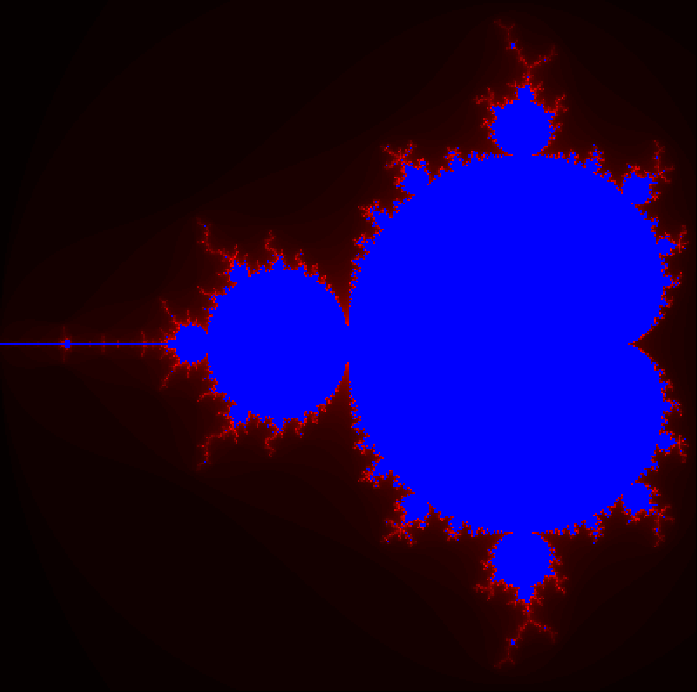

# 🌀 Exploration de l'ensemble de Mandelbrot

Ce projet, réalisé dans le cadre de la SAÉ 2.02, explore la puissance des nombres complexes pour générer des fractales. L'objectif est de comprendre l'algorithmique derrière le tracé de Mandelbrot et d'implémenter un zoom dynamique dans la "vallée des hippocampes".

##  Objectifs techniques
- **Mathématiques** : Utilisation des propriétés des nombres complexes ($z_{n+1} = z_n^2 + c$).
- **Algorithmique** : Optimisation des boucles d'itération pour le rendu graphique.
- **Visualisation** : Création d'images fractales avec `matplotlib` pour analyser le comportement des suites.

## outils Technique
- **Langage** : Python 3.
- **Bibliothèques** : `matplotlib` (pour le rendu), `numpy` (pour les calculs matriciels).
- **Environnement** : Jupyter Notebook.

##  Aperçu

##  Comment l'utiliser ?
1. Cloner ce dépôt.
2. Ouvrir `SAE202.ipynb` via JupyterLab ou VS Code.
3. Exécuter les cellules pour générer vos propres zooms sur la fractale.
